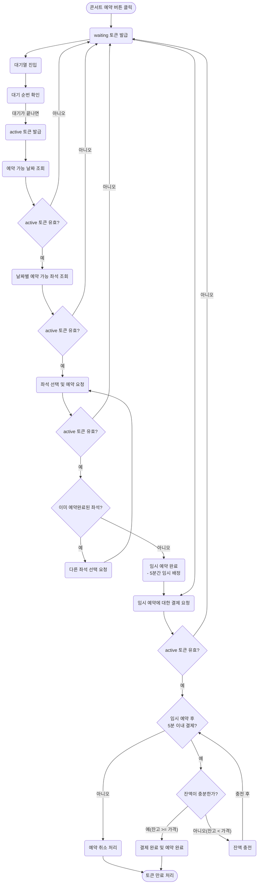

### 예약 페이지에 진입 후 결제까지의 프로세스

```mermaid
flowchart TB
    start([콘서트 예약 버튼 클릭]) --> issue_token(waiting 토큰 발급) --> enter_queue(대기열 진입)
    enter_queue --> check_queue_no(대기 순번 확인) -- 대기가 끝나면 --> active_token(active 토큰 발급)
    active_token --> date_list(예약 가능 날짜 조회) --> validate_token1{active 토큰 유효?}
    validate_token1 -- 예 --> seat_list(날짜별 예약 가능 좌석 조회)
    validate_token1 -- 아니오 --> issue_token

    seat_list --> validate_token2{active 토큰 유효?}  
    validate_token2 -- 예 --> select_seat(좌석 선택 및 예약 요청) --> validate_token3{active 토큰 유효?}
    validate_token2 -- 아니오 --> issue_token

    validate_token3 -- 예 --> validate_seat{이미 예약완료된 좌석?}
    validate_token3 -- 아니오 --> issue_token
    validate_seat -- 예 --> again_select_seat(다른 좌석 선택 요청) --> select_seat
    validate_seat -- 아니오 --> temp_reservation(임시 예약 완료<br/>- 5분간 임시 배정)
    temp_reservation --> start_pay(임시 예약에 대한 결제 요청) --> validate_token4{active 토큰 유효?}
    validate_token4 -- 예 --> payment_in_5m{임시 예약 후 <br/>5분 이내 결제?}
    validate_token4 -- 아니오 --> issue_token --> start_pay

    payment_in_5m -- 예 --> check_balance{잔액이 충분한가?}
    payment_in_5m -- 아니오 --> cancel_reservation(예약 취소 처리)  --> delete_token([토큰 만료 처리])
    check_balance -- 예(잔고 >= 가격) --> pay_done(결제 완료 및 예약 완료) --> delete_token
    check_balance -- 아니오(잔고 < 가격) --> charge_balance(잔액 충전) -- 충전 후 --> payment_in_5m

```
