### 대기열 토큰 발급 API
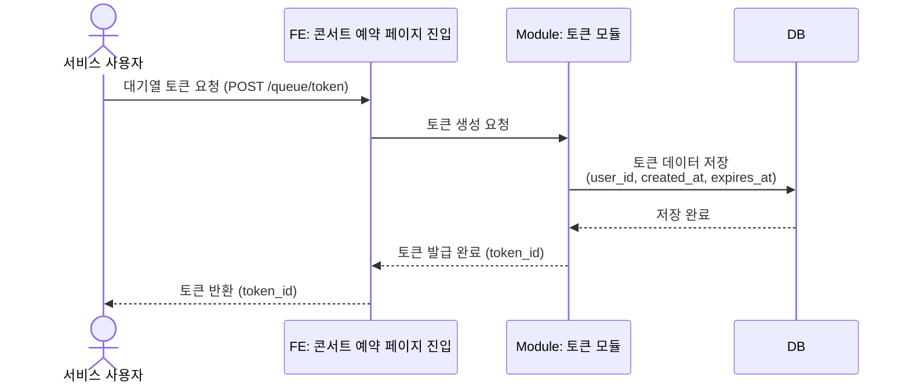

### 대기 순번 조회 API
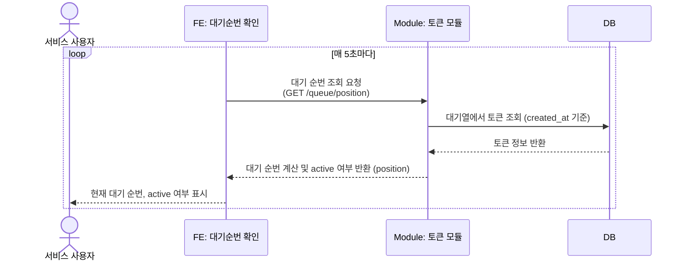

### active 토큰 변환 스케줄러 (1분마다 실행)
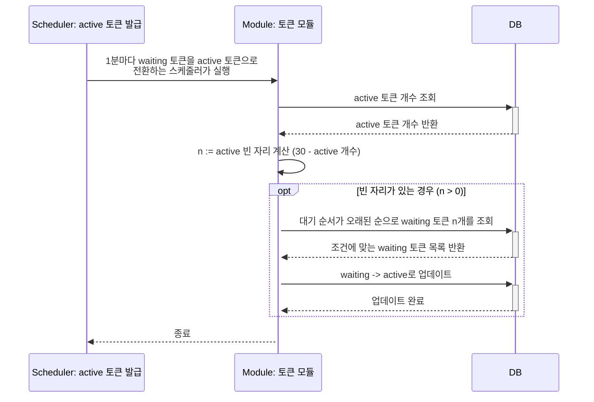

### 만료된 토큰을 처리하는 스케줄러 (5분마다 실행)
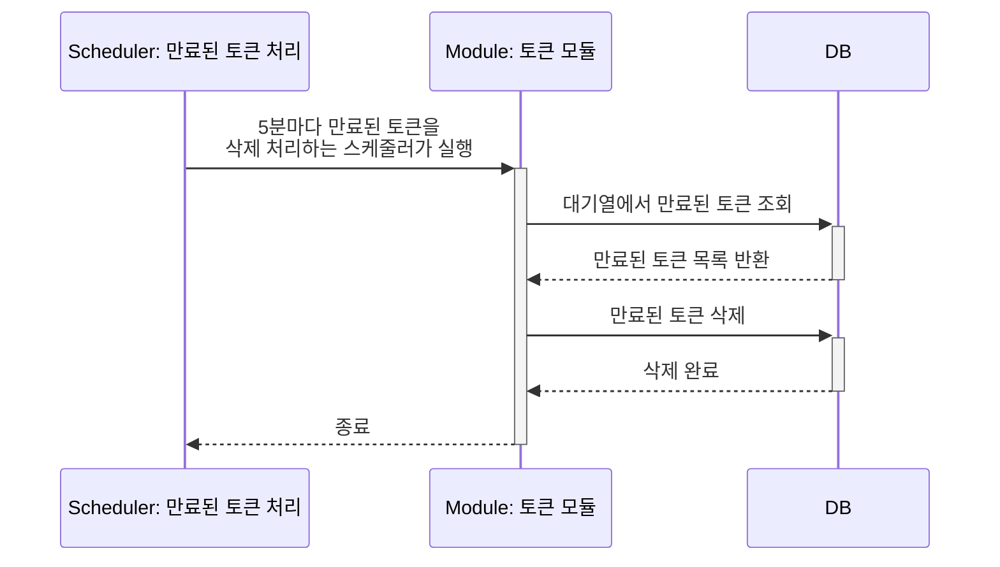

### 예약 가능한 날짜 목록 조회 API
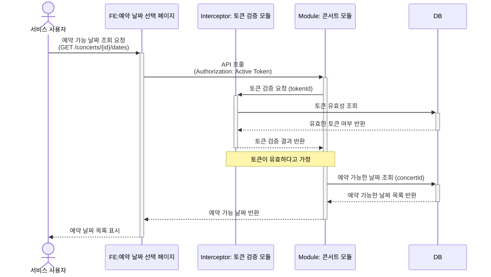

### 예약 가능한 날짜별 좌석 목록 조회 API
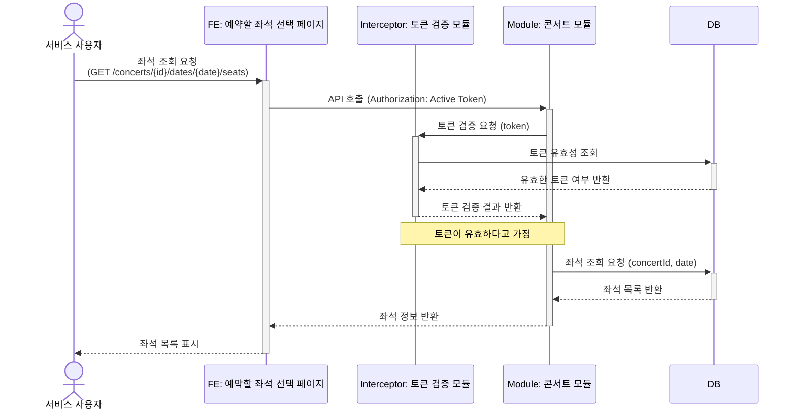

### 예약 요청 API
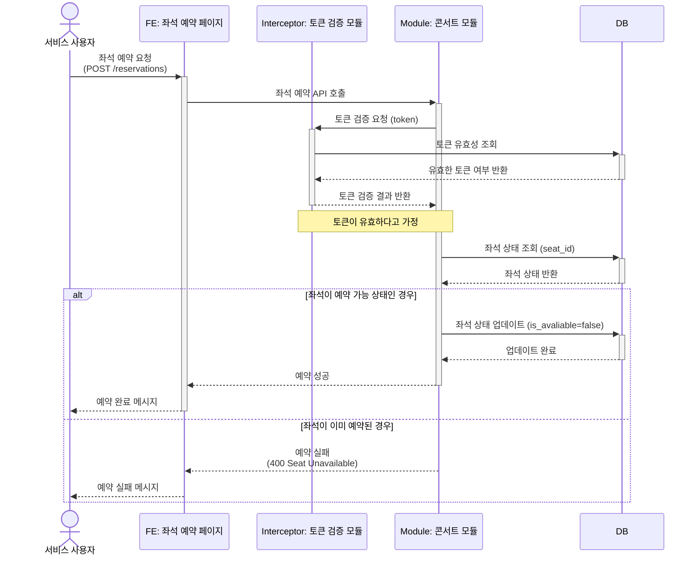

### 임시 예약이 만료된 것을 처리하는 스케줄러 (1분마다 실행)
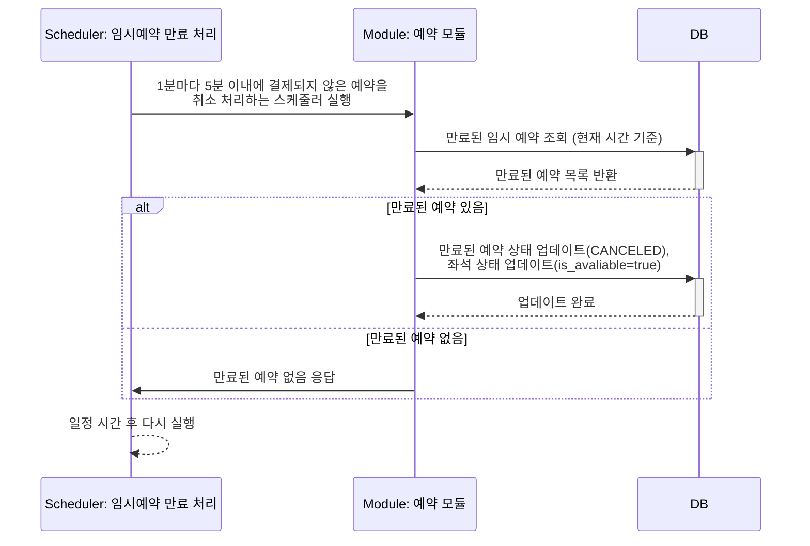

### 결제 요청 API
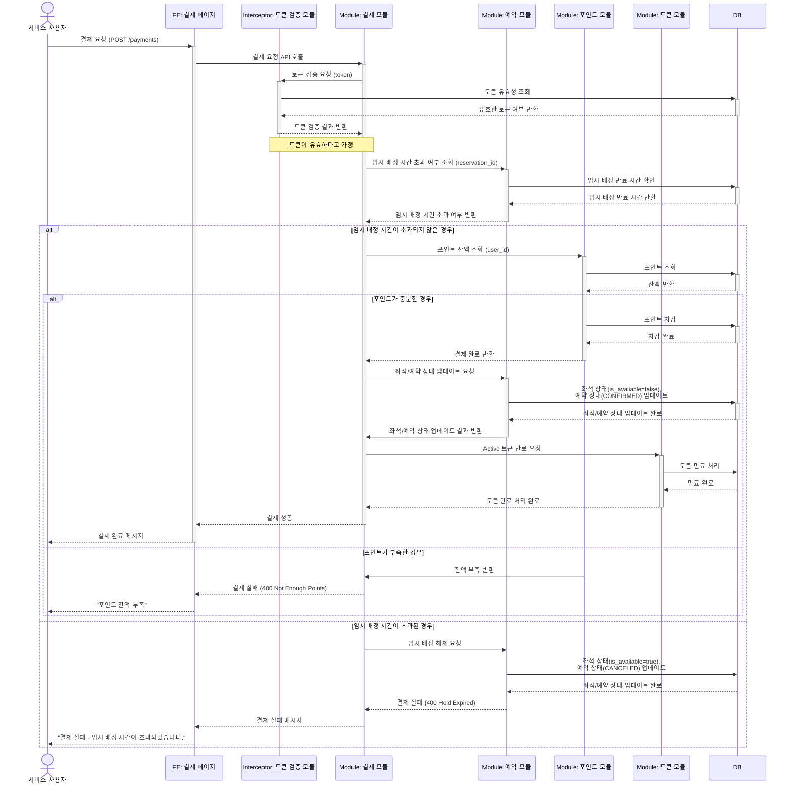

### 잔액 충전 API
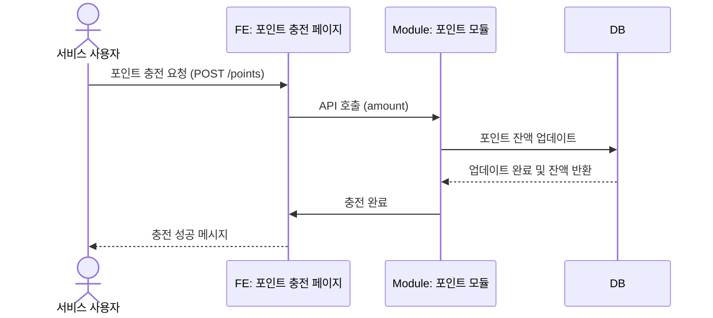

### 잔액 조회 API
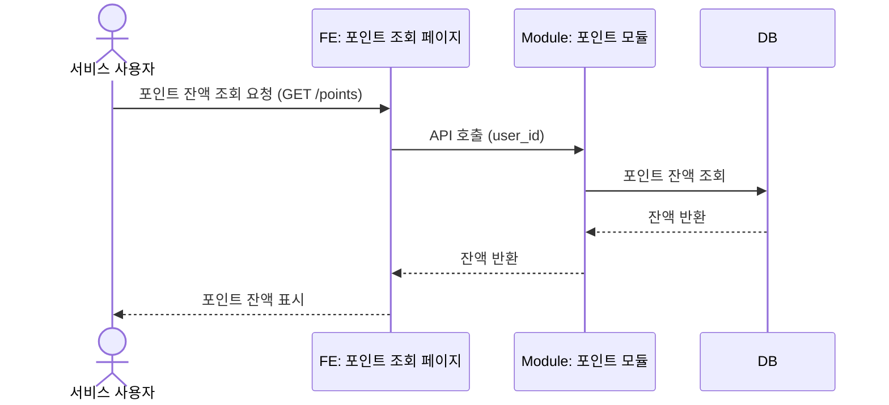